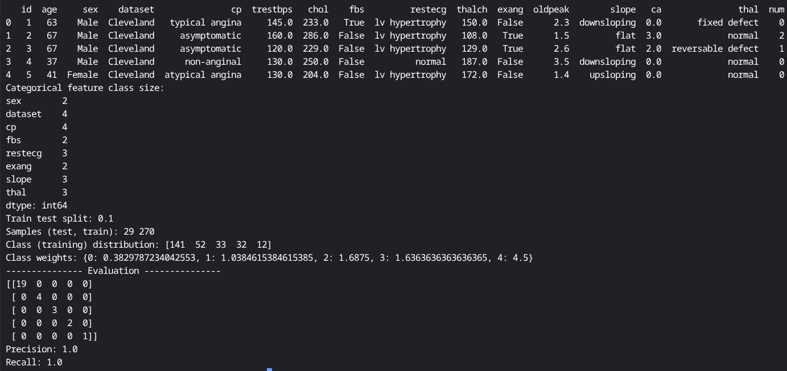

# UCI Heart disease dataset model comparison

Data: [UCI heart disease](https://archive.ics.uci.edu/dataset/45/heart+disease) 

[Dataset description (Kaggle)](https://www.kaggle.com/datasets/redwankarimsony/heart-disease-data)

### Models 

SVM + class weights

XGBoost (no class weights)

